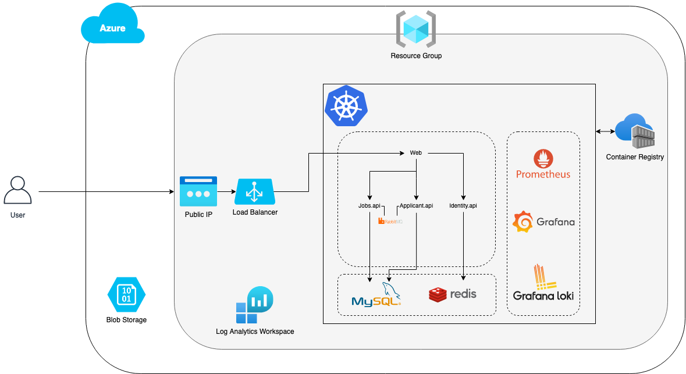

# Orchestration - School project
*Fifth Year @ Ynov Informatique Paris*
Le but était de migrer une application en micro-service vers un cluster Kubernetes.

## Collaborateurs
- Maxence Colmant [@maxencecolmant](https://github.com/maxencecolmant)
- Quentin Leclercq [@QuentinL-hub](https://github.com/QuentinL-hub)
- Valentin Marlier [@vmarlier](https://github.com/vmarlier)

Slide de rendu final: /files/Soutenance-slide.pdf

Diagram de l'infrastructure finale:

# I- Sujet

## Applications 

L'objectif est le déploiement, la maintenance et la mise à jour de différents micro-services REST et applications web dans un environnement conteneurisé, avec un orchestrateur Kubernetes afin d'assurer la haute disponibilité des apps.

## Ce qui est fournis

Pour ce projet, je jouerais le rôle du développeur. Vous pourrez donc me poser des questions sur le fonctionnement des apps, ce qu'elles ont besoin en terme de ressources et de liaisons. Si il le faut, je pourrais modifier le code des applications afin de les adapter à votre système (tant que ça reste de la configuration). Les applications sont disponibles sur le [git](https://github.com/bart120/maj2/tree/main/appscore) du cours.
Description des apps:
- web => application web qui consomme les services applicants.api et jobs.api
- applicants.api => service API REST fournissant des données d'une base de données.
- identity.api => service API REST fournissant une authentification
- jobs.api => service API REST fournissant des données d'une base de données.
- sql.data => base données SqlServer et données
- rabbitmq => fournis une communication entre les services API REST

Les relations sont décrites dans le fichier docker-compose.

## Conteneur

Vous devrez créer les fichiers afin de générer des images de conteneur de chaque app. Les apps étant réalisées sur des technos différentes, il vous faudra bien préparer les images pour que les apps s'éxécutent sans problèmes (image de base, ouverture de port, mise en réseau..).
Les images devront par la suite être envoyées vers un repo d'images.

## Hébergement

Les apps devront être déployées dans Kubernetes. C'est à vous qu'appartient le choix de tous les paramètres (taille du cluster, nombre de noeuds, nombre de replicat, réseau virtuel, volume physique, pods, services, ingress...) nécessaires pour chaque app.
La mise en réseau des conteneurs devra se faire dans le cluster, seule les apps ayant besoin d'être appelées de l'extérieur devront être ouverte à la communication extérieure.
N'oublier pas d'utiliser les étiquettes afin d'organiser vos éléments de manière plus simple.

## Performance

Afin de ne pas avoir de problèmes de surcharge, chaque pod devra avoir une limite de consommation CPU, mémoire et disque ainsi que des demandes de ressources définies.
Les pods devront également redémarrer automatiquement si ils tombent.
Il vous faudra définir des "règles d'affinité" entre vos éléments afin d'en améliorer les échanges.

## Bilan de santé

Votre devra être sous surveillance!  Vous devrez réaliser "un bilan de santé" de votre cluster en métant en place les sondes de préparation et les sondes de vivacité.
De même vous devrez mettre en place les mesures par métrique, les métriques de l'état du cluster, les métriques de ressources des noeuds et des pods ainsi que [les métriques de travail du plan de contrôle](https://kubernetes.io/docs/concepts/cluster-administration/system-metrics) (Metrics server et kube-state-metrics).

## Sécurité

Vos apps devront être accessible uniquement par le protocole https de l'exterieur. Il vous faudra donc générer un [certificat](https://kubernetes.io/docs/tasks/tls/managing-tls-in-a-cluster) (auto-signé) SSL, et l'associer à votre cluster.

## Logs

Les apps font remonter des logs dans la sortie standard. Afin de pouvoir les exploiter correctement il vous faudra mettre en place une pile complète EFK afin de fournir une gestion de logs avancée.

## Déploiement continu

Afin d'automatiser les mises à jour et le déploiement des app, vous mettre en place un système de déploiement continu sur Azure DevOps.
Vous ne vous devez pas gérer l'intégration juste le déploiement, à savoir: récupération des sources, création des images, création des éléments dans le cluster.
